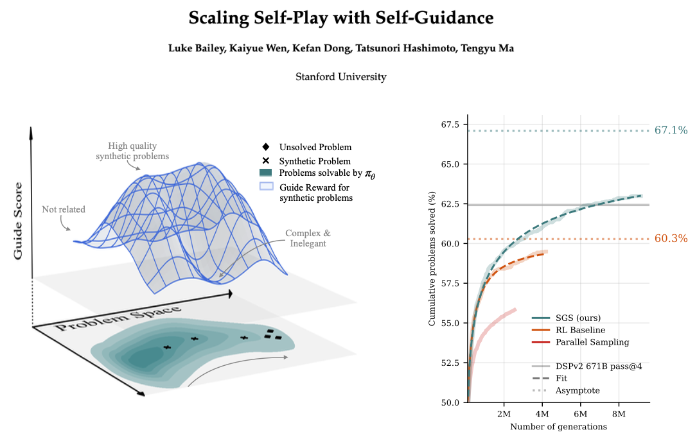

# Scaling Self-Play with Self-Guidance

[](https://arxiv.org/abs/2604.20209)

<p align="center">
  
</p>

Official implementation of **Scaling Self-Play with Self-Guidance**.

SGS is an asymmetric self-play algorithm in which a single language model takes on three roles — **Solver**, **Conjecturer**, and **Guide** — with the Guide 
supervising the Conjecturer to produce high quality synthetic problems. Applied to DeepSeek-Prover-V2-7B and trained on ~3000 Lean4 formal math problems, SGS 
surpasses the pass@4 of the 671B parameter DeepSeek-Prover-V2-671B model.

## Setup

All experiments are tested and can run on 8xH200 node. 


1. **Create the Python environment.** 
   ```bash
   conda env create -f environment.yml
   conda activate sgs
   pip install -r requirements.txt
   pip install -e .
   ```

2. **Install `elan` (Lean toolchain manager)** if you don't already have it. See <https://github.com/leanprover/elan> for instructions.

3. **Build the Lean REPL and mathlib4.** `setup.sh` clones the two repositories at matching Lean `v4.15.0` tags, runs `lake exe cache get` on mathlib, and compiles both. Expect 
this to take over 10 minutes.
   ```bash
   ./setup.sh
   ```
   This produces `./repl/` and `./mathlib4/` at the repo root.

4. **Configure environment variables.** Create a `.env` file at the repo root:
   ```env
   SGS_REPL_PATH=./repl/.lake/build/bin/repl
   SGS_MATHLIB_PATH=./mathlib4
   # Optional, for wandb logging:
   WANDB_API_KEY=...
   ```
   The Lean verifier reads `SGS_REPL_PATH` and `SGS_MATHLIB_PATH` at import time and will raise if either is unset.

5. **(Optional)** Log into wandb if you want experiment tracking:
   ```bash
   wandb login
   ```

The training data (~3000 Lean 4 formal math problems) is hosted on Hugging Face at [`LukeBailey181Pub/D_3k`](https://huggingface.co/datasets/LukeBailey181Pub/D_3k) and is pulled automatically when a run starts.

## Scripts

Each of the experiments in the paper corresponds to one entry-point script in `scripts/`:

| Script | Role |
|---|---|
| `scripts/standard_sgs.py` | Main method — full SGS pipeline (Solver + Conjecturer + Guide) |
| `scripts/cispo_sgs.py` | SGS using the CISPO (grouped importance-sampled) solver objective |
| `scripts/cispo_solver_only.py` | CISPO baseline — solver training only, no conjecturing |
| `scripts/ei_solver_only.py` | Expert-Iteration baseline — solver training only |
| `scripts/sgs_frozen_conjecturer.py` | Ablation: freeze the Conjecturer, only train the Solver |
| `scripts/sgs_no_guide.py` | Ablation: run SGS without the Guide component |
| `scripts/sgs_no_problem_conditioning.py` | Ablation: Conjecturer generates problems without conditioning on a seed problem |

Run an experiment with:

```bash
python scripts/standard_sgs.py
```

Each script configures its own `checkpoint_dir` and `wandb_tags` at the bottom of the file. Checkpoints, logs, and intermediate proof datasets are written into `checkpoint_dir`.


## Citation

```bibtex
@article{bailey2026scaling,
  title={Scaling Self-Play with Self-Guidance},
  author={Bailey, Luke and Wen, Kaiyue and Dong, Kefan and Hashimoto, Tatsunori and Ma, Tengyu},
  journal={arXiv preprint arXiv:2604.20209},
  year={2026}
}
```
